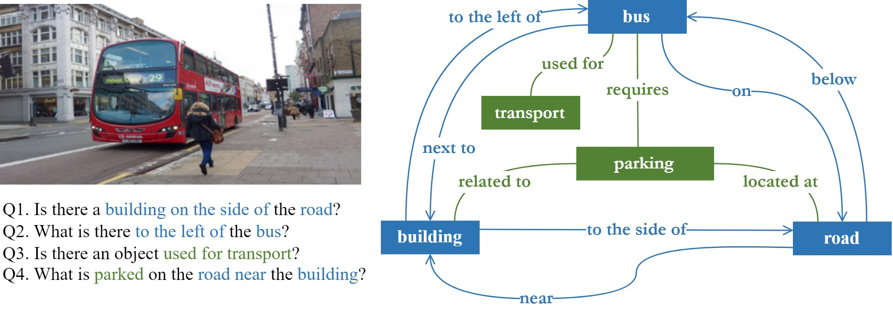

# NeSyVQA: Neurosymbolic Visual Qestion Answering via Scene Graph Enrichment

## Requirements
- Ubuntu 18.04
- CUDA 10.1
- Python 3.7
- PyTorch 1.4
- KGTK 0.5

## Downloads
- [GQA dataset](https://cs.stanford.edu/people/dorarad/gqa/download.html)
- [VG dataset](https://visualgenome.org/api/v0/api_home.html)
- [CSKG embeddings](https://drive.google.com/drive/u/1/folders/16347KHSloJJZIbgC9V5gH7_pRx0CzjPQ)
- [Faster RCNN pretrained network](https://1drv.ms/u/s!AmRLLNf6bzcir8xemVHbqPBrvjjtQg?e=hAhYCw)
- [SGG pretrained network](https://1drv.ms/u/s!AmRLLNf6bzcir9x7OYb6sKBlzoXuYA?e=s3Y602)
- Preprocessed datasets, precomputed embeddings amnd pretrained networks are available in SSG-VQA/downloads

## Code
- [Scene Graph Generation and Enrichment with Evaluation](SSG/ssg.ipynb)
- [Visual Question Answering with Evaluation](VQA/vqa.ipynb)

## Directories
- Scene Graph Generation and Enrichment: [SSG](SSG)
- Visual Question Answering: [VQA](VQA) 
- Generated scene graphs of all images (in [Eval_IO/vg/0_images](Eval_IO/vg/0_images)) in the dataset are saved to [Eval_IO/vg/1_pred_scene_graphs](Eval_IO/vg/1_pred_scene_graphs) 
- Enriched scene graphs are saved to [Eval_IO/vg/2_enriched_scene_graphs](Eval_IO/vg/2_enriched_scene_graphs)
- VQA results are saved to [Eval_IO/vg/3_vqa](Eval_IO/vg/3_vqa)
